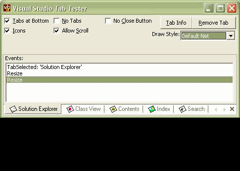



## VB TabX

### Description

An Update To The VB Accelerator Tab Control.

The Tab Now Supports Xp Style Rendering.

Since Steve Has Not Replied To My Emails And The Code Is Lying About On My Computer Doing Nothing, I Thought I Would Upload It So Other People Could Use It (If They Like).

Note: Steve Must Take Credit For His Original Works, I Only Updated The Drawing And Fixed A Few Bugs.

Although The Original Code Is Not Commented Very Well, You Can See The Changes Made By Searching For 'Ammended By'

Kind Regards

Gary
 
### More Info
 

             |
---                |---
**Submitted On**   |2003-04-27 18:46:32
**By**             |[Phantom Man](https://github.com/Planet-Source-Code/PSCIndex/blob/master/ByAuthor/phantom-man.md)
**Level**          |Advanced
**User Rating**    |4.9 (141 globes from 29 users)
**Compatibility**  |VB 6\.0
**Category**       |[Custom Controls/ Forms/  Menus](https://github.com/Planet-Source-Code/PSCIndex/blob/master/ByCategory/custom-controls-forms-menus__1-4.md)
**World**          |[Visual Basic](https://github.com/Planet-Source-Code/PSCIndex/blob/master/ByWorld/visual-basic.md)
**Archive File**   |[VB\_TabX1813021112004\.zip](https://github.com/Planet-Source-Code/phantom-man-vb-tabx__1-57045/archive/master.zip)

